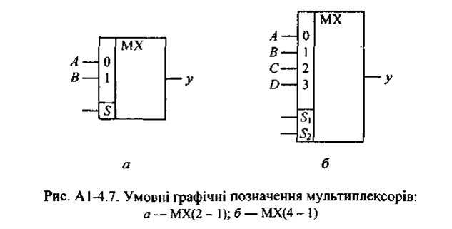
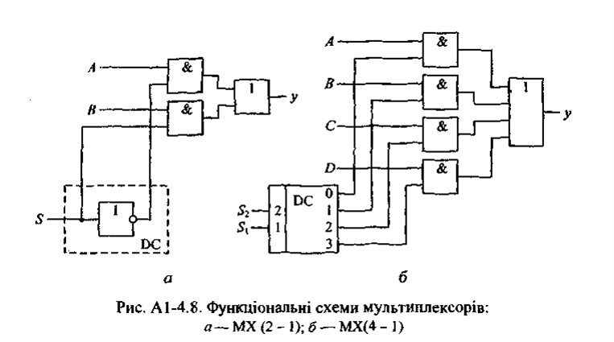

# Тема: Проектування комбінаційних схем на мультиплексорах

## 📘 Теоретичні відомості

## Мультиплексори
Мультиплексор — це типова комбінаційна схема (комутатор), що підключає до свого виходу один із інформаційних входів відповідно до сигналів, які подаються на керуючі (адресні) входи.

Мультиплексор має:

n = 2ˢ інформаційних входів, де s = 1, 2, 3,...

s = log₂(n) адресних входів

Однорозрядний мультиплексор з n інформаційними входами характеризується парою чисел n та 1 і позначається як МХ(n – 1). Наприклад:

МХ(4 – 1) — однорозрядний мультиплексор із чотирма інформаційними входами;

МХ(2 – 1) — однорозрядний мультиплексор із двома інформаційними входами.

Умовні графічні позначення мультиплексорів МХ(2 - 1) і МХ(4 - 1) зображені на рис. А 1-4.7, а і б, їх таблиці істинності - відповідно у табл. 7.1 та 7.2, а функціональні схеми — на рис. А1-4.8.

### Таблиця 7.1 — Таблиця істинності мультиплексора МХ(2–1)

| **S** | **Y** |
|:-----:|:-----:|
| 0     | A     |
| 1     | B     |

### Таблиця 7.2 — Таблиця істинності мультиплексора МХ(4–1)

| **S₂** | **S₁** | **Y** |
|:------:|:------:|:-----:|
| 0      | 0      | A     |
| 0      | 1      | B     |
| 1      | 0      | C     |
| 1      | 1      | D     |

Виходом однорозрядного мультиплексора є вихід елемента АБО, до входів якого через елементи І підключаються інформаційні входи.  
Управління підключенням може забезпечити дешифратор.

Під час побудови багаторозрядних мультиплексорів для управління групами входів кожного розряду (виходу) використовується один дешифратор.

Якщо на інформаційні входи мультиплексора подати двійковий вектор, що відповідає стовпцю значень заданої функції `f` в таблиці істинності,  
а на адресні входи — значення змінних, то мультиплексор реалізує функцію `f(x₁, x₂, ..., xₙ)`.

Якщо мультиплексор містить `n` адресних входів, то на такому мультиплексорі можна реалізувати будь-яку булеву функцію `n + 1` змінної.

#### Приклад реалізації функції `f(x₁, x₂, ..., xₙ₊₁)`:

1. Представимо функцію `f(x₁, x₂, ..., xₙ₊₁)` її таблицею істинності.
2. Змінні `x₁, x₂, ..., xₙ` виберемо як адресні змінні мультиплексора.
3. Змінну `xₙ₊₁` подамо на інформаційні входи мультиплексора.

Можливі наступні чотири ситуації для будь-яких сусідніх двійкових наборів довжини `n + 1` з однаковою адресною частиною:

1. `f = 1`  
2. `f = 0`  
3. `f = xₙ₊₁`  
4. `f = x̅ₙ₊₁`

Таким чином, якщо змінні `x₁, x₂, ..., xₙ` подати на адресні входи мультиплексора,  
то для реалізації функції `f(x₁, x₂, ..., xₙ₊₁)` необхідно на кожному інформаційному вході реалізувати одну з таких функцій:

- константу `0`;
- константу `1`;
- `xₙ₊₁`;
- `x̅ₙ₊₁`.

---

## 🧪 Хід роботи

### 🔢 Задане число

Число: `2211`  
Двійковий запис: `100010100011` (h₉h₈h₇h₆h₅h₄h₃h₂h₁)

### Таблиця 7.4 – Таблиця істинності

| x₁ | x₂ | x₃ | x₄ | f₄ | f₄' |
|:--:|:--:|:--:|:--:|:---------:|:----------:|
|  0 |  0 |  0 |  0 |     1     |     1      |
|  0 |  0 |  0 |  1 |    h₁     |     1      |
|  0 |  0 |  1 |  0 |    h₂     |     1      |
|  0 |  0 |  1 |  1 |    h₃     |     0      |
|  0 |  1 |  0 |  0 |    h₄     |     0      |
|  0 |  1 |  0 |  1 |     1     |     1      |
|  0 |  1 |  1 |  0 |    h₅     |     0      |
|  0 |  1 |  1 |  1 |     0     |     0      |
|  1 |  0 |  0 |  0 |    h₆     |     1      |
|  1 |  0 |  0 |  1 |    h₇     |     0      |
|  1 |  0 |  1 |  0 |     1     |     1      |
|  1 |  0 |  1 |  1 |    h₈     |     1      |
|  1 |  1 |  0 |  0 |     0     |     0      |
|  1 |  1 |  0 |  1 |     1     |     1      |
|  1 |  1 |  1 |  0 |    h₉     |     0      |
|  1 |  1 |  1 |  1 |     0     |     0      |
